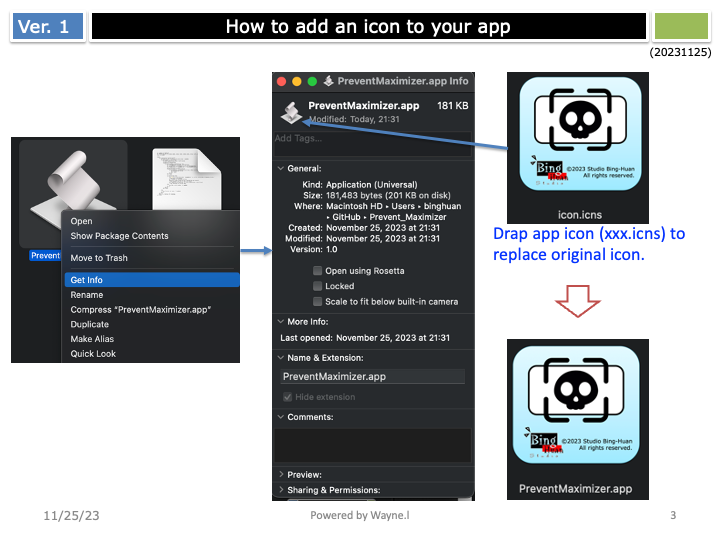

  
# Prevent Maximizer
- [Prevent Maximizer](#prevent-maximizer)
  - [Features](#features)
  - [How it Works](#how-it-works)
  - [Usage](#usage)
  - [Converting AppleScript to an Application](#converting-applescript-to-an-application)
  - [Adding an Icon to Your App](#adding-an-icon-to-your-app)
  - [Launching the Application on Startup](#launching-the-application-on-startup)
  - [System Requirements](#system-requirements)
  - [Control flow](#control-flow)
  - [Demo](#demo)

This utility for macOS is designed to address an often-overlooked issue where some applications may unpredictably enter full-screen mode, interrupting the user's workflow, especially when working with split-screen setups. This tool aims to mitigate unintended app behaviors by restoring the app back from full-screen to its original state, maintaining the user's workflow continuity.

## Features
- **Automatic Detection:** Monitors applications entering full-screen mode without user initiation.
- **Non-Disruptive:** Operates in the background, providing a seamless experience without interrupting the user's current tasks.
- **Quick Restore:** Reverts apps back from full-screen to windowed mode, allowing users to continue their work without manual adjustments.

## How it Works
`PreventMaximizer` runs discreetly in the background. When it detects an application has entered full-screen mode without user consent, it automatically triggers a command to exit the full-screen mode, effectively "preventing" the application from "maximizing" and taking over the entire screen.

## Usage
1. Double-click the file "PreventMaximizer.applescript".
2. Modify the application name in the script to the one you want to monitor. 
   ```applescript
   set appName to "Wea"
3. Convert AppleScript to an Application.
4. Move PreventMaximizer.app to your Applications folder.
5. Launch the application.
6. Allow the app to control your computer by granting Accessibility permissions.


## Converting AppleScript to an Application
Follow these steps to convert your script into a standalone application:


## Adding an Icon to Your App
Personalize your application by adding a custom icon:


## Launching the Application on Startup
To have PreventMaximizer automatically start when you log in:


## System Requirements
macOS version 10.14 (Mojave) or later.

## Control flow 


## Demo 
